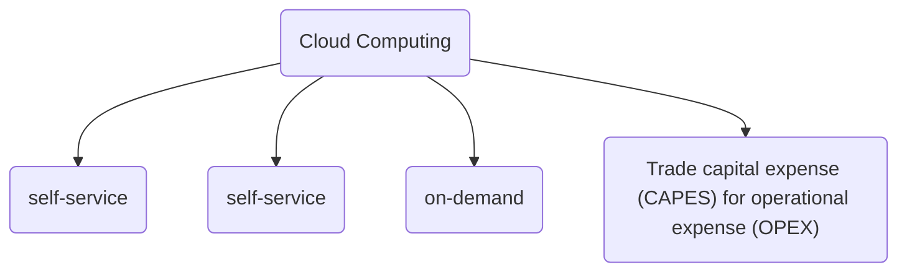

# AWS

```mermaid
flowchart TD
    G(Cloud Computing) --> H(self-service)
    G --> I(self-service)
    G --> J(on-demand)
    G --> K("Trade capital expense (CAPES) for operational expense (OPEX)")
```