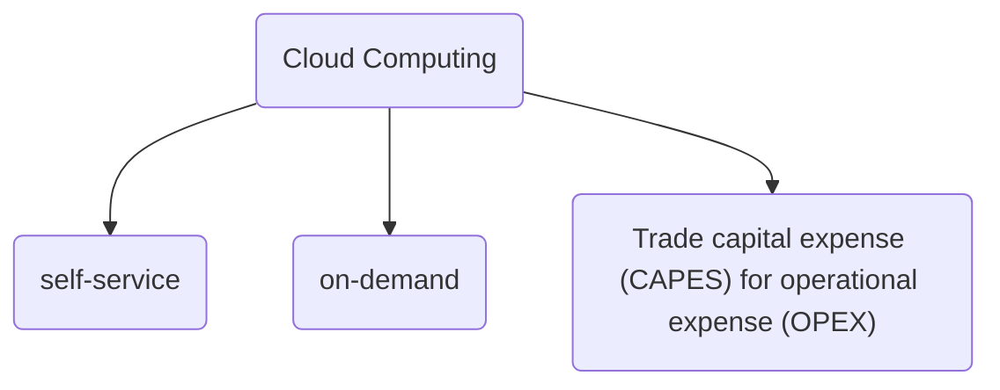
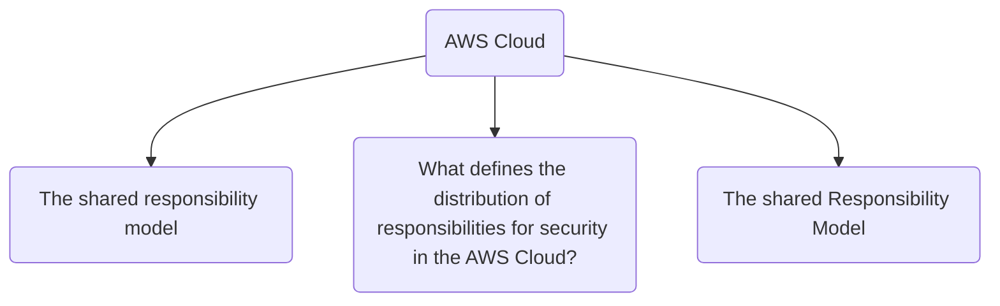
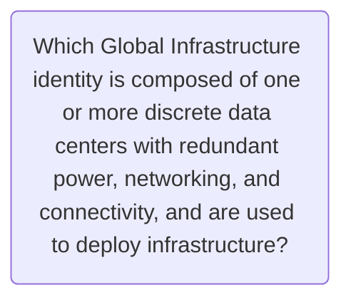
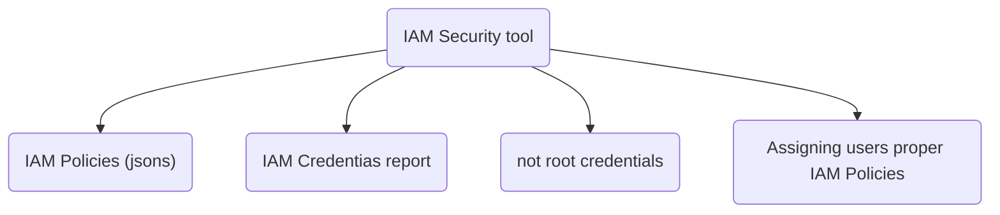

# AWS

## 3 cloud computing

```mermaid
flowchart TD
    G(Cloud Computing) --> H(self-service)
    G --> J(on-demand)
    G --> K("Trade capital expense (CAPES) for operational expense (OPEX)")
```

```mermaid
flowchart TD
    G(AWS Cloud) --> H(The shared responsibility model)
    G --> I(What defines the distribution of responsibilities for security in the AWS Cloud?)
    G --> J(The shared Responsibility Model)
```

```mermaid
flowchart TD
    G(Which Global Infrastructure identity is composed of one or more discrete data centers with redundant power, networking, and connectivity, and are used to deploy infrastructure?)
```

## 4 IAM Security tool

```mermaid
```mermaid
flowchart TD
    G(IAM Security tool) --> H("IAM Policies (jsons)")
    G --> I(IAM  Credentias report)
    G --> J(not root credentials)
    G --> K(Assigning users proper IAM Policies)
```