# AWS

## 3 cloud computing

## 4 IAM Security tool

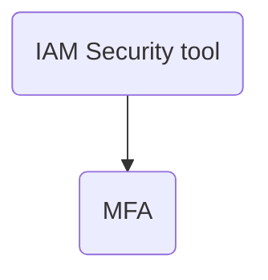

## 7 Elastic Load Balancing & Auto Scaling Groups

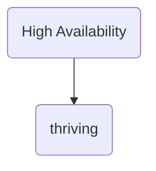
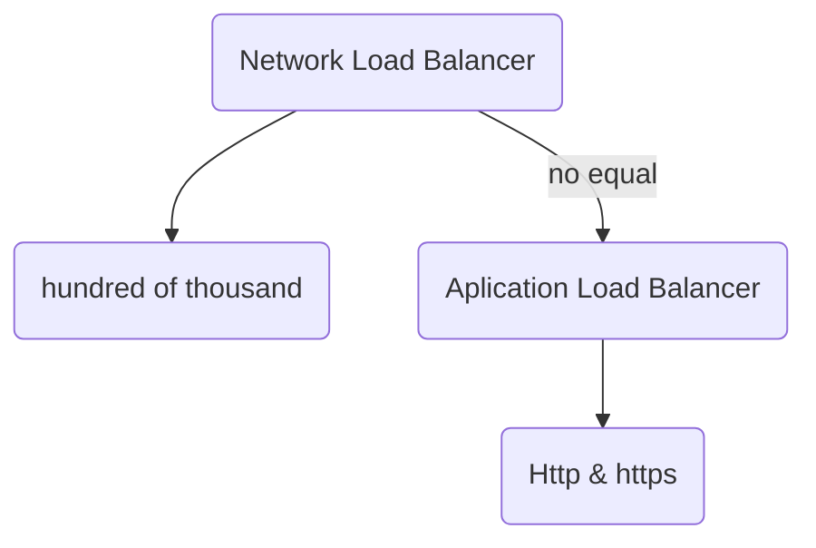
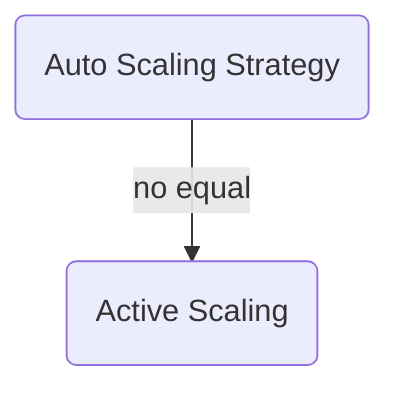
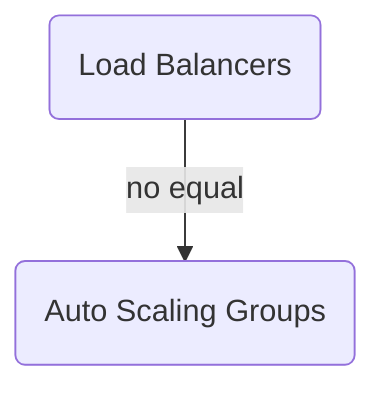
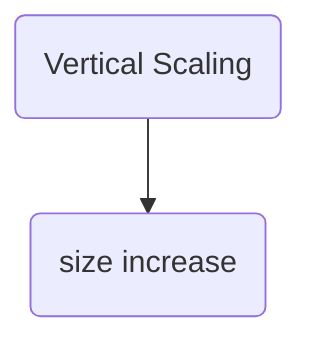
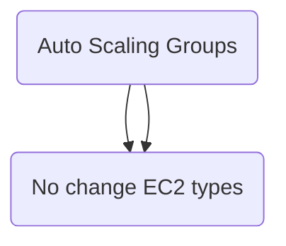
## 8 Amazon S3
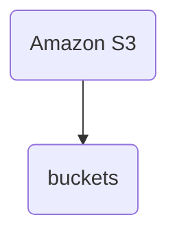
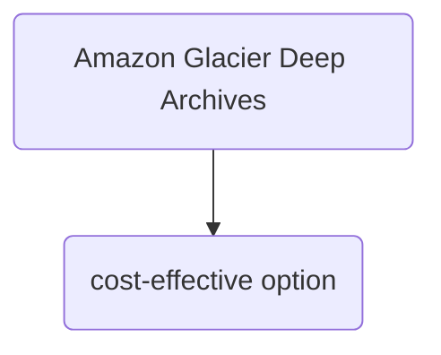
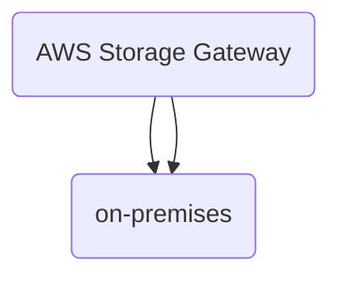
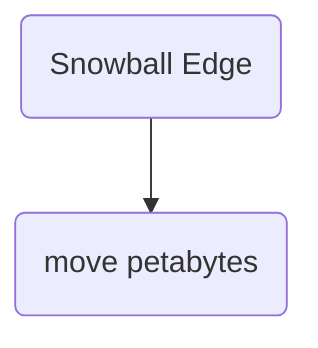

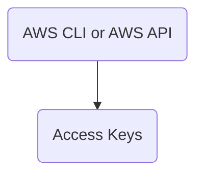

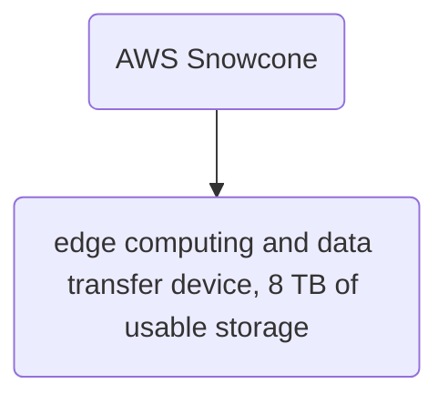
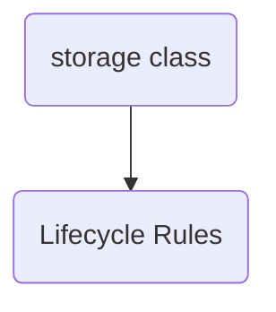
## 14 Cloud Watch

## 15 Network Access Control List (NACL)
- NAT Gateways, allow your instances in your private subnet to access the Internet while remaining private
- public and private subnet
- Site-toSite VPN, it's not public
- Internet gateway, horizontally scaled, redundant, and highly available VPC component
- AWS Direct Connect, makes it easy to establish a dedicated private network connection
- VPC Peering, communicate with each other
- VPC, (virtual private cloud)
- Transit Gateway, connect hundred of VPC

## 16 RDS, data at rest
- RDS, data at rest
- Macie, discover and protect sensitive data in AWS
- WAF Web Application firewall, protect against web exploits
- SSL y TLS (ACM) Certificate Manager
- The customer, firewall and configuration EC2 Instances
- Detective, find the root of potential security issues
- Inspector, automated security assessment service, helps to improve security and compliance of applications
- Artifact find on-demand access to AWS compliance documentation
- Penetration Testing is allowed without prior on 8 services. DDoS, port flooding and protocol flooding are examples of prohibited activities
- Security Hub, centrall automate security checks
- KMS, easily create and control the keys
- Access the billing dashboard not require the root user
- Shield, safeguard running aplications from DDoS attacks
- GuardDuty,  is a threat detection service that continuously monitors for malicious activity and unauthorized behavior 
- Losing your MFA device not contact AWS abuse Team ¿
- The situations where you should contact the AWS Abuse team are: Spam, Port scanning, DoS or DDoS attacks, Intrusion attempts, Hosting objectionable or copyrighted content, Distributing malware.